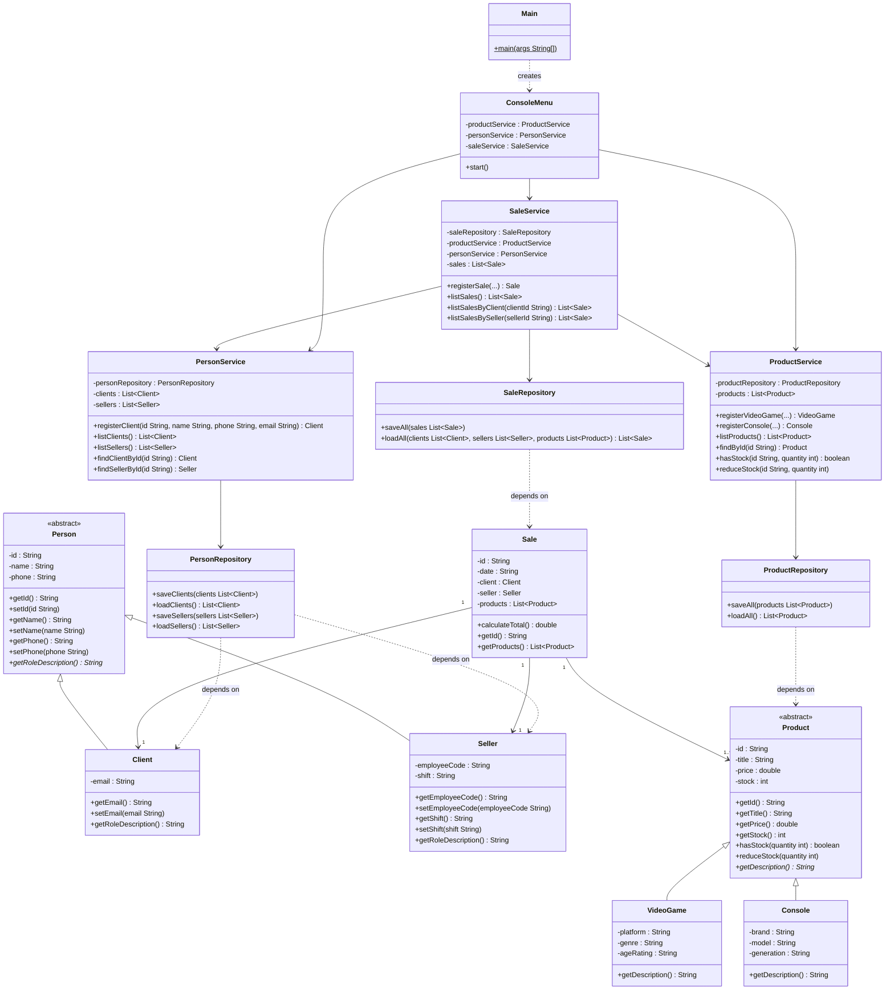

```mermaid
classDiagram
    %% ===== MODEL LAYER =====
    class Person {
        <<abstract>>
        -id : String
        -name : String
        -phone : String
        +getId() String
        +setId(id String)
        +getName() String
        +setName(name String)
        +getPhone() String
        +setPhone(phone String)
        +getRoleDescription()* String
    }
    class Client {
        -email : String
        +getEmail() String
        +setEmail(email String)
        +getRoleDescription() String
    }
    class Seller {
        -employeeCode : String
        -shift : String
        +getEmployeeCode() String
        +setEmployeeCode(employeeCode String)
        +getShift() String
        +setShift(shift String)
        +getRoleDescription() String
    }
    Person <|-- Client
    Person <|-- Seller

    class Product {
        <<abstract>>
        -id : String
        -title : String
        -price : double
        -stock : int
        +getId() String
        +getTitle() String
        +getPrice() double
        +getStock() int
        +hasStock(quantity int) boolean
        +reduceStock(quantity int)
        +getDescription()* String
    }
    class VideoGame {
        -platform : String
        -genre : String
        -ageRating : String
        +getDescription() String
    }
    class Console {
        -brand : String
        -model : String
        -generation : String
        +getDescription() String
    }
    Product <|-- VideoGame
    Product <|-- Console

    class Sale {
        -id : String
        -date : String
        -client : Client
        -seller : Seller
        -products : List~Product~
        +calculateTotal() double
        +getId() String
        +getProducts() List~Product~
    }
    Sale "1" --> "1" Client
    Sale "1" --> "1" Seller
    Sale "1" --> "1..*" Product

    %% ===== PERSISTENCE LAYER =====
    class PersonRepository {
        +saveClients(clients List~Client~)
        +loadClients() List~Client~
        +saveSellers(sellers List~Seller~)
        +loadSellers() List~Seller~
    }
    class ProductRepository {
        +saveAll(products List~Product~)
        +loadAll() List~Product~
    }
    class SaleRepository {
        +saveAll(sales List~Sale~)
        +loadAll(clients List~Client~, sellers List~Seller~, products List~Product~) List~Sale~
    }
    PersonRepository ..> Client : depends on
    PersonRepository ..> Seller : depends on
    ProductRepository ..> Product : depends on
    SaleRepository ..> Sale : depends on

    %% ===== SERVICE LAYER =====
    class PersonService {
        -personRepository : PersonRepository
        -clients : List~Client~
        -sellers : List~Seller~
        +registerClient(id String, name String, phone String, email String) Client
        +listClients() List~Client~
        +listSellers() List~Seller~
        +findClientById(id String) Client
        +findSellerById(id String) Seller
    }
    class ProductService {
        -productRepository : ProductRepository
        -products : List~Product~
        +registerVideoGame(...) VideoGame
        +registerConsole(...) Console
        +listProducts() List~Product~
        +findById(id String) Product
        +hasStock(id String, quantity int) boolean
        +reduceStock(id String, quantity int)
    }
    class SaleService {
        -saleRepository : SaleRepository
        -productService : ProductService
        -personService : PersonService
        -sales : List~Sale~
        +registerSale(...) Sale
        +listSales() List~Sale~
        +listSalesByClient(clientId String) List~Sale~
        +listSalesBySeller(sellerId String) List~Sale~
    }
    PersonService --> PersonRepository
    ProductService --> ProductRepository
    SaleService --> SaleRepository
    SaleService --> ProductService
    SaleService --> PersonService

    %% ===== UI LAYER =====
    class ConsoleMenu {
        -productService : ProductService
        -personService : PersonService
        -saleService : SaleService
        +start()
    }
    class Main {
        +main(args String[])$
    }
    ConsoleMenu --> ProductService
    ConsoleMenu --> PersonService
    ConsoleMenu --> SaleService
    Main ..> ConsoleMenu : creates
```