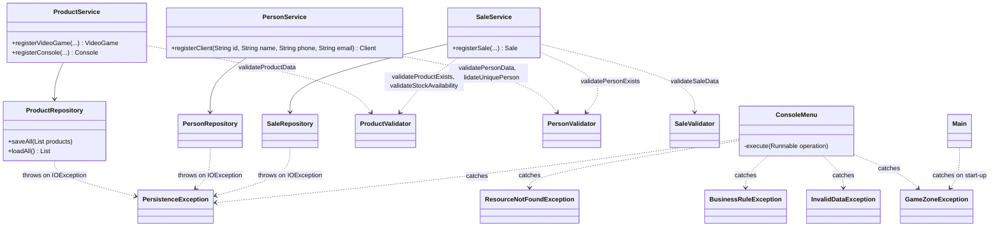

# Exception Class Diagram

## Exceptions and validators

```mermaid
classDiagram
    class RuntimeException
    class GameZoneException {
        <<abstract>>
        -String errorCode
        +GameZoneException(String message)
        +GameZoneException(String message, String errorCode)
        +getErrorCode() String
    }
    class ResourceNotFoundException {
        +ResourceNotFoundException(String resourceType, String identifier)
    }
    class BusinessRuleException {
        +BusinessRuleException(String message)
    }
    class InvalidDataException {
        +InvalidDataException(String fieldName, String description)
    }
    class PersistenceException {
        +PersistenceException(String message, Throwable cause)
    }
    class ProductValidator {
        +validateProductData(String id, String title, double price, int stock)$
        +validateStockAvailability(Product product, int requestedQuantity)$
        +validateProductExists(Product product, String productId)$
    }
    class PersonValidator {
        +validatePersonData(String id, String name, String email, String phone)$
        +validatePersonExists(Person person, String personId)$
        +validateUniquePerson(List existing, String newId)$
    }
    class SaleValidator {
        +validateSaleData(Client customer, Seller seller, List products)$
        +validateSaleExists(Sale sale, String saleId)$
    }
    RuntimeException <|-- GameZoneException
    GameZoneException <|-- ResourceNotFoundException
    GameZoneException <|-- BusinessRuleException
    GameZoneException <|-- InvalidDataException
    GameZoneException <|-- PersistenceException
    ProductValidator ..> ResourceNotFoundException : throws
    ProductValidator ..> BusinessRuleException : throws
    ProductValidator ..> InvalidDataException : throws
    PersonValidator ..> ResourceNotFoundException : throws
    PersonValidator ..> BusinessRuleException : throws
    PersonValidator ..> InvalidDataException : throws
    SaleValidator ..> ResourceNotFoundException : throws
    SaleValidator ..> BusinessRuleException : throws
    SaleValidator ..> InvalidDataException : throws
    Return ..> BusinessRuleException : throws
```
## Services and repositories integration

```mermaid
classDiagram
    class ProductService {
        +registerVideoGame(...) VideoGame
        +registerConsole(...) Console
    }
    class PersonService {
        +registerClient(String id, String name, String phone, String email) Client
    }
    class SaleService {
        +registerSale(...) Sale
    }
    class ProductRepository {
        +saveAll(List products)
        +loadAll() List
    }
    class PersonRepository
    class SaleRepository
    class ProductValidator
    class PersonValidator
    class SaleValidator
    class PersistenceException
    ProductService ..> ProductValidator : validateProductData
    PersonService ..> PersonValidator : validatePersonData, validateUniquePerson
    SaleService ..> PersonValidator : validatePersonExists
    SaleService ..> ProductValidator : validateProductExists, validateStockAvailability
    SaleService ..> SaleValidator : validateSaleData
    ProductService --> ProductRepository
    PersonService --> PersonRepository
    SaleService --> SaleRepository
    ProductRepository ..> PersistenceException : throws on IOException
    PersonRepository ..> PersistenceException : throws on IOException
    SaleRepository ..> PersistenceException : throws on IOException
    class ConsoleMenu {
        -execute(Runnable operation)
    }
    class Main
    ConsoleMenu ..> ResourceNotFoundException : catches
    ConsoleMenu ..> BusinessRuleException : catches
    ConsoleMenu ..> InvalidDataException : catches
    ConsoleMenu ..> PersistenceException : catches
    ConsoleMenu ..> GameZoneException : catches
    Main ..> GameZoneException : catches on start-up
```
