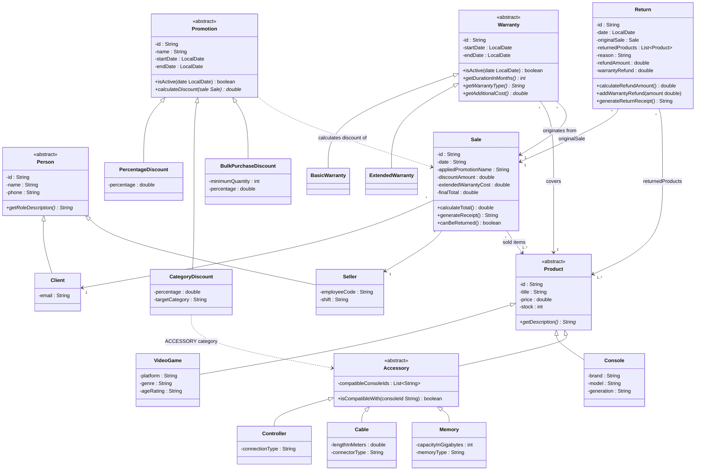
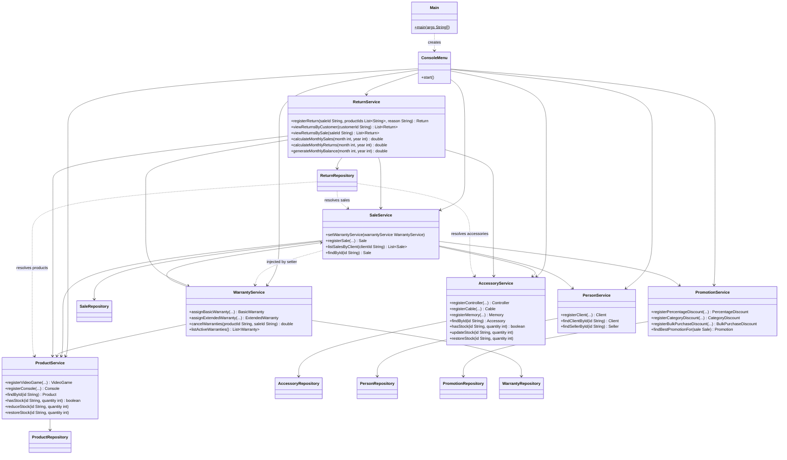

# Integrated Class Diagram

This document shows the final structure of the system after integrating the four modules of Workshop 2 (accessories, promotions, warranties and returns) with the base of Workshop 1 (products, people and sales). It is split in two diagrams to keep them readable: the model layer, and the service and persistence layers with the menu.

## 1. Model layer

Notes on the model:

- `Sale` stores the result of the sale (promotion name, discount, extended warranty cost and final total), so a return can refund according to what the customer really paid (adjustment A5).
- `Return` keeps the part of the refund that comes from cancelled warranties apart from the refund of the items (`warrantyRefund`), as defined in adjustment A7.
- A `Sale` and a `Return` can contain any `Product`, which includes accessories because `Accessory` extends `Product`.

## 2. Service, persistence and menu layers

Notes on the services:

- **Inventory.** `ProductService` owns the stock of video games and consoles, and `AccessoryService` owns the stock of accessories. `SaleService` and `ReturnService` always delegate to the service that owns the item (adjustments A3 and A4).
- **Construction order.** `SaleService` is built first without a `WarrantyService`; then `WarrantyService` is built, and it is injected back with `setWarrantyService` (adjustment A2). `ReturnRepository` and `ReturnService` are built last, because they need the sale, inventory and warranty services.
- **Returns and warranties.** `ReturnService` is the only class that connects both modules: when a console is returned, it calls `WarrantyService.cancelWarranties` and adds the refundable cost to the return (adjustment A7).
- **Monthly balance.** `ReturnService` reads the sales through `SaleService`, so the dependency goes from returns to sales and never the other way (adjustment A6).