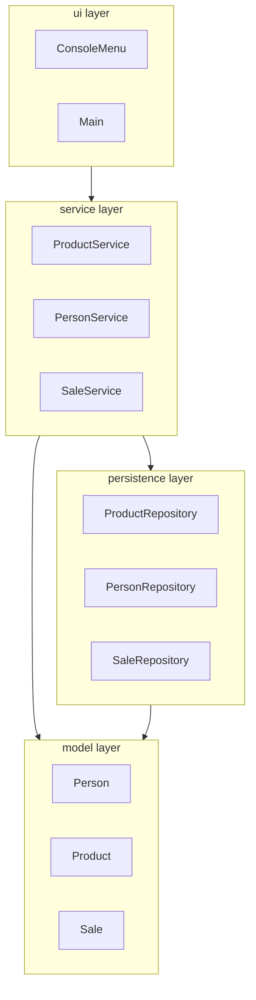

```mermaid
flowchart TD
    subgraph UI["ui layer"]
        ConsoleMenu
        Main
    end
    subgraph SERVICE["service layer"]
        ProductService
        PersonService
        SaleService
    end
    subgraph PERSISTENCE["persistence layer"]
        ProductRepository
        PersonRepository
        SaleRepository
    end
    subgraph MODEL["model layer"]
        Person
        Product
        Sale
    end

    UI --> SERVICE
    SERVICE --> PERSISTENCE
    SERVICE --> MODEL
    PERSISTENCE --> MODEL
```