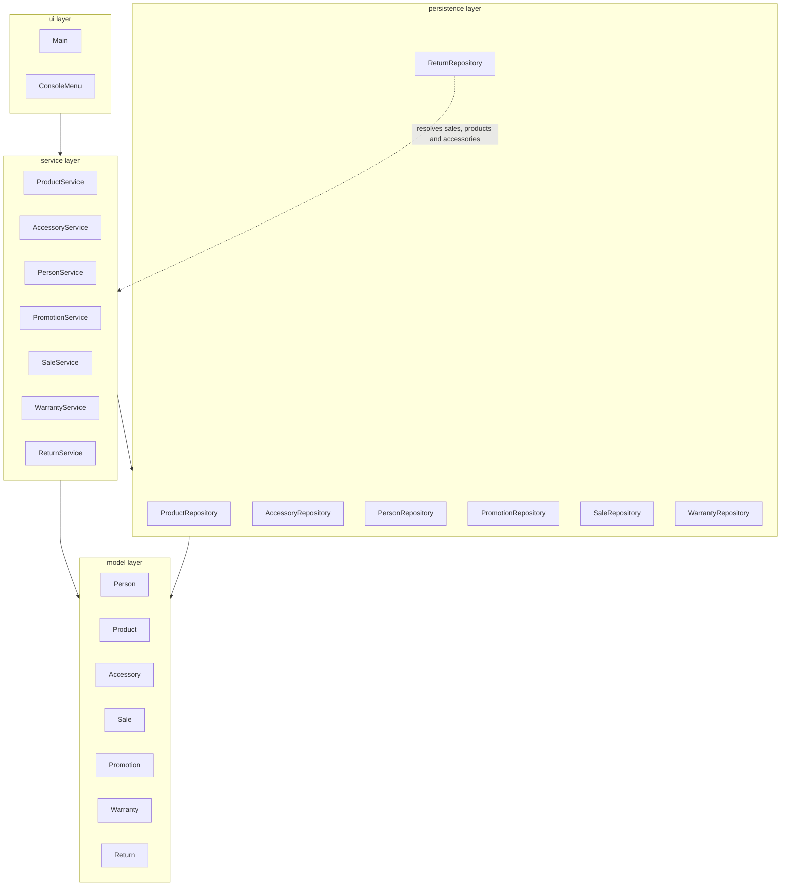

## Dependencies between services

Inside the service layer, the modules depend on each other in one direction only:

- `SaleService` uses `ProductService`, `AccessoryService`, `PersonService` and `PromotionService`.
- `WarrantyService` uses `SaleService` and `ProductService`. `SaleService` receives the `WarrantyService` later through a setter, which avoids a circular dependency (adjustment A2).
- `ReturnService` uses `SaleService`, `ProductService`, `AccessoryService` and `WarrantyService`.

## Known exception to the layer order

`ReturnRepository` is the only class of the persistence layer that depends on services (`SaleService`, `ProductService` and `AccessoryService`, dotted line in the diagram). A return is saved with ids only, and when it is loaded the repository needs the real `Sale` and `Product` objects, which are owned by those services. The other repositories keep the rule `service -> persistence -> model`. The dependency does not create a cycle, because `Main` builds `ReturnRepository` after those three services.