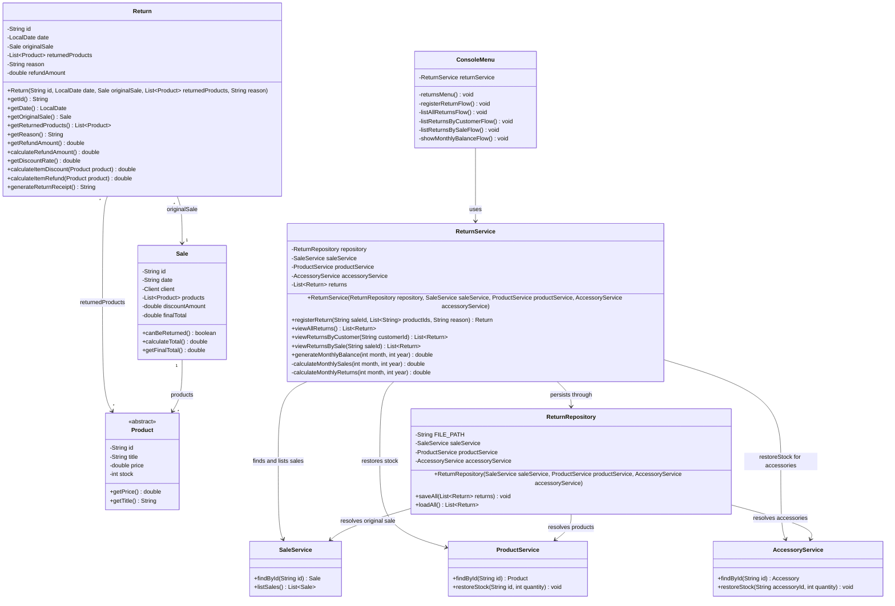

# Class Diagram: Return Module

This document contains the class diagram of the Return module in the GameZone Unicesar system. It shows the new Return class and its relationship with Sale and Product, the persistence and service classes of the module, and how the module is integrated with the existing system (SaleService, ProductService and the ConsoleMenu extension).

## Mermaid Diagram

